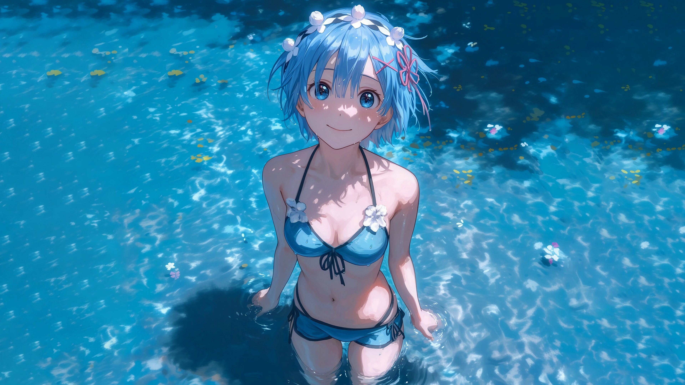

  

  

你好，我叫用心，一个乐观的男孩，喜欢编程。

如：

- Vue
- Go
- Python

欢迎来到我的 Github。电子邮件 ： `2224693191@qq.com`

<h3 align="center">
  
  技术之浪 | Tech Waves
</h3>

    
    
    

<h3 align="center">
  
  兴趣 | Wave Interests
</h3>

  
  
  

  

<picture>
  <source media="(prefers-color-scheme: dark)" srcset="https://raw.githubusercontent.com/platane/platane/output/github-contribution-grid-snake-dark.svg">
  <source media="(prefers-color-scheme: light)" srcset="https://raw.githubusercontent.com/platane/platane/output/github-contribution-grid-snake.svg">
  
</picture>

